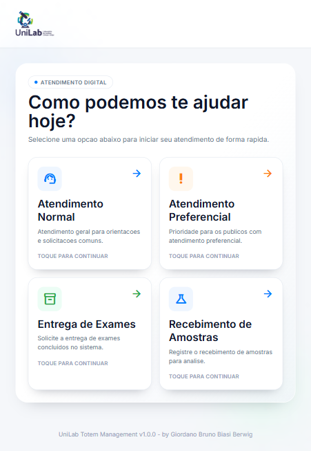
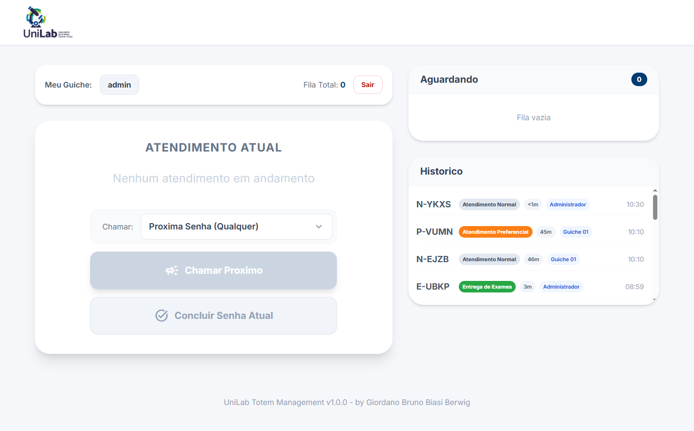
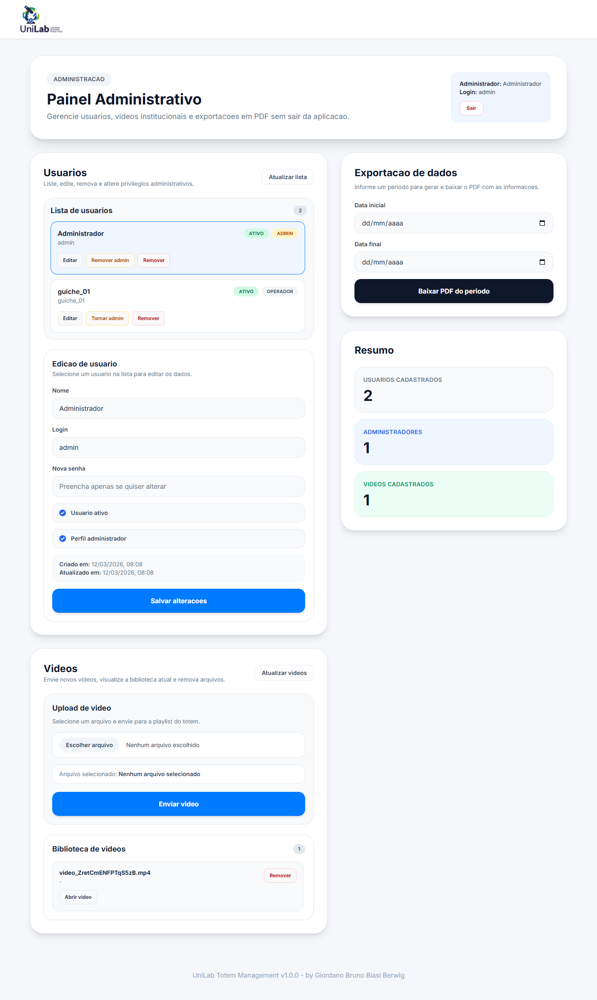
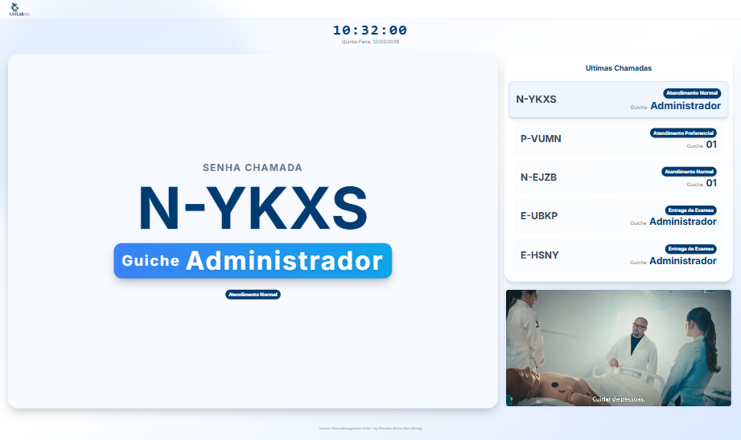

# UniLab Frontend Totem

Aplicacao frontend do sistema de senhas e atendimento da UniLab.

O projeto cobre o fluxo completo do totem, desde a emissao publica de senha ate as operacoes internas de atendimento, administracao e exibicao em TV. A base foi desenvolvida com React, TypeScript e Vite, com foco em telas modulares, services dedicados e integracao direta com a API via `X-API-KEY`.

## Sumario

- Visao geral
- Capturas da aplicacao
- Stack e dependencias
- Funcionalidades
- Rotas da aplicacao
- Estrutura do projeto
- Requisitos
- Configuracao do ambiente
- Variaveis de ambiente
- Execucao local
- Integracao com API
- Autenticacao e sessao
- Scripts disponiveis
- Padroes de desenvolvimento
- Troubleshooting

## Visao geral

Fluxos implementados atualmente:

- Tela publica para emissao de senha por tipo de servico.
- Tela de login para operadores e administradores.
- Painel de atendente com fila, senha atual, historico e acoes de chamada/conclusao.
- Painel administrativo para usuarios, videos e relatorios.
- Tela de TV para exibicao da senha chamada, ultimas chamadas e playlist de videos.

O frontend utiliza polling para manter as telas operacionais sincronizadas com o backend e possui uma separacao clara entre componentes visuais, regras de tela, utilitarios e camada de servicos.

## Capturas da aplicacao

### Tela publica



### Painel de atendimento



### Painel administrativo



### Tela de TV



## Stack e dependencias

- React 19
- TypeScript 5
- Vite 7
- React Router DOM 7
- ESLint 9
- jsPDF
- Tailwind CSS via CDN no `index.html`
- Google Material Icons Outlined

## Funcionalidades

### Emissao de senha

- Seleciona o tipo de atendimento.
- Envia a criacao da senha para a API.
- Exibe feedback visual de sucesso e erro.

### Login e sessao

- Autenticacao por login e senha.
- Persistencia da sessao no `sessionStorage`.
- Redirecionamento automatico para rotas protegidas.

### Painel de atendente

- Lista fila de espera em tempo real.
- Permite chamar a proxima senha de qualquer tipo ou de um tipo especifico.
- Exibe atendimento atual.
- Conclui atendimento atual.
- Mantem historico recente de atendimentos concluidos.

### Painel administrativo

- Lista usuarios cadastrados.
- Atualiza dados de usuario.
- Remove usuarios.
- Promove ou remove privilegios administrativos.
- Lista e remove videos cadastrados.
- Envia novos videos para a API.
- Gera relatorio de atendimentos por periodo.

### Tela de TV

- Exibe a senha atualmente chamada.
- Exibe historico recente de chamadas.
- Busca playlist de videos na API.
- Carrega o arquivo do video por `GET /videos/{filename}` com `X-API-KEY`.
- Reproduz o video com rotacao automatica entre itens da playlist.

## Rotas da aplicacao

As rotas atuais estao definidas em `src/App.tsx`:

- `/`: tela publica de emissao de senha.
- `/tv`: tela de exibicao da TV.
- `/login`: tela de autenticacao.
- `/attendent`: tela protegida do atendente.
- `/admin`: tela protegida de administracao.

## Estrutura do projeto

```text
.
|-- README-images/
|-- README.md
|-- package.json
|-- src/
|   |-- App.tsx
|   |-- main.tsx
|   |-- auth/
|   |   |-- session.ts
|   |-- components/
|   |   |-- auth/
|   |   |   |-- ProtectedRoute.tsx
|   |   |-- layout/
|   |   |   |-- Footer/index.tsx
|   |   |   |-- Header/index.tsx
|   |   |   |-- Layout/index.tsx
|   |   |-- ui/
|   |       |-- ActionCard/index.tsx
|   |       |-- Badges/index.tsx
|   |       |-- Clock/index.tsx
|   |       |-- CustomSelect/index.tsx
|   |-- screens/
|   |   |-- Admin/
|   |   |   |-- components/
|   |   |   |-- index.tsx
|   |   |   |-- reportPdf.ts
|   |   |   |-- types.ts
|   |   |   |-- utils.ts
|   |   |-- Attendent/
|   |   |   |-- components/
|   |   |   |-- index.tsx
|   |   |   |-- types.ts
|   |   |   |-- utils.ts
|   |   |-- GetTicket/
|   |   |   |-- components/
|   |   |   |-- constants.ts
|   |   |   |-- index.tsx
|   |   |   |-- types.ts
|   |   |-- Login/
|   |   |   |-- components/
|   |   |   |-- index.tsx
|   |   |-- TV/
|   |       |-- components/
|   |       |-- index.tsx
|   |       |-- types.ts
|   |       |-- utils.ts
|   |-- services/
|       |-- adminService.ts
|       |-- apiConfig.ts
|       |-- attendantService.ts
|       |-- authService.ts
|       |-- ticketService.ts
|       |-- tvService.ts
```

## Requisitos

- Node.js 20+
- npm 10+
- Backend da API UniLab em execucao

## Configuracao do ambiente

1. Instale as dependencias:

```bash
npm install
```

2. Crie o arquivo `.env` a partir do exemplo:

```bash
cp .env.example .env
```

No Windows PowerShell:

```powershell
Copy-Item .env.example .env
```

3. Ajuste os valores do ambiente conforme sua API.

## Variaveis de ambiente

Variaveis principais documentadas em `.env.example`:

```env
VITE_API_BASE_URL=http://localhost:8000/api
VITE_API_TICKETS_PATH=/tickets
VITE_API_KEY=your-api-key-here
VITE_API_TIMEOUT_MS=10000
```

Descricao:

- `VITE_API_BASE_URL`: URL base da API.
- `VITE_API_TICKETS_PATH`: path base do recurso de senhas.
- `VITE_API_KEY`: chave enviada no header `X-API-KEY`.
- `VITE_API_TIMEOUT_MS`: timeout padrao das requisicoes.

Variaveis opcionais utilizadas por modulos especificos:

- `VITE_USERS_ENDPOINT`
- `VITE_VIDEOS_ENDPOINT`
- `VITE_VIDEOS_UPLOAD_ENDPOINT`
- `VITE_REPORT_PDF_ENDPOINT`
- `VITE_TV_RECENTLY_CALLED_PATH`
- `VITE_VIDEOS_PATH`

Quando essas variaveis nao sao definidas, os services utilizam defaults apontando para o backend local.

## Execucao local

Ambiente de desenvolvimento:

```bash
npm run dev
```

URL padrao do Vite:

- `http://localhost:5173`

Build de producao:

```bash
npm run build
```

Preview do build:

```bash
npm run preview
```

Lint:

```bash
npm run lint
```

## Integracao com API

### Configuracao central

Arquivo principal: `src/services/apiConfig.ts`

Responsabilidades:

- normalizar URL base e paths,
- centralizar `baseUrl`, `ticketsPath`, `apiKey` e `timeoutMs`,
- gerar URLs finais para os services.

### Emissao de senha

Arquivo: `src/services/ticketService.ts`

Operacao:

- `POST {baseUrl}{ticketsPath}`

Payload esperado:

```json
{
  "service_type": "Atendimento Normal"
}
```

### Autenticacao

Arquivo: `src/services/authService.ts`

Operacao:

- `POST {baseUrl}/login`

Headers:

- `Content-Type: application/json`
- `X-API-KEY: <VITE_API_KEY>`

### Atendimento

Arquivo: `src/services/attendantService.ts`

Operacoes:

- `GET {baseUrl}{ticketsPath}`
- `GET {baseUrl}{ticketsPath}/completed`
- `POST {baseUrl}{ticketsPath}/{id}/call`
- `PATCH {baseUrl}{ticketsPath}/{id}/complete`

### Administracao

Arquivo: `src/services/adminService.ts`

Operacoes:

- gestao de usuarios,
- upload e remocao de videos,
- geracao de relatorios,
- troca de privilegios administrativos.

### TV

Arquivo: `src/services/tvService.ts`

Operacoes:

- `GET /tickets/recently-called`
- `GET /videos`
- `GET /videos/{filename}`

Observacao importante:

- a tela de TV carrega o arquivo do video via `fetch` para garantir envio do header `X-API-KEY` em todas as consultas a API.

## Autenticacao e sessao

Arquivos principais:

- `src/auth/session.ts`
- `src/components/auth/ProtectedRoute.tsx`

Comportamento atual:

- a sessao e persistida no `sessionStorage` com a chave `totem_auth`,
- `ProtectedRoute` exige `access_token` para liberar rotas protegidas,
- quando `requireAdmin` e informado, usuarios sem perfil admin sao redirecionados para `/attendent`.

Campos esperados na sessao:

- `data.access_token`
- `data.user.login`
- `data.user.is_admin`

## Scripts disponiveis

- `npm run dev`: sobe o ambiente de desenvolvimento.
- `npm run build`: executa type-check e build de producao.
- `npm run preview`: publica o build local para validacao.
- `npm run lint`: executa o lint do projeto.

## Padroes de desenvolvimento

- camada de integracao isolada em `src/services`,
- componentes de interface separados por responsabilidade,
- `types.ts` e `utils.ts` por modulo de tela,
- tratamento explicito de timeout e falha de comunicacao,
- polling controlado nas telas operacionais,
- rotas protegidas centralizadas em `ProtectedRoute`.

## Troubleshooting

### A API nao responde

- confirme se o backend esta ativo,
- revise `VITE_API_BASE_URL`,
- valide a `VITE_API_KEY`,
- teste os endpoints diretamente com o mesmo header `X-API-KEY`.

### A tela de TV lista videos mas nao reproduz

- confirme se o endpoint `GET /videos/{filename}` retorna o binario do arquivo,
- valide se o header `X-API-KEY` esta sendo aceito nesse endpoint,
- verifique se o backend retorna um arquivo de video valido.

### Rotas protegidas redirecionam para login

- confira a sessao em `sessionStorage`,
- valide se o `access_token` ainda esta valido,
- confirme se o usuario realmente possui `is_admin` quando acessa `/admin`.

### O build falha

- execute `npm run build` para obter o erro completo,
- confira imports e caminhos,
- valide tipagem dos services e componentes novos.
