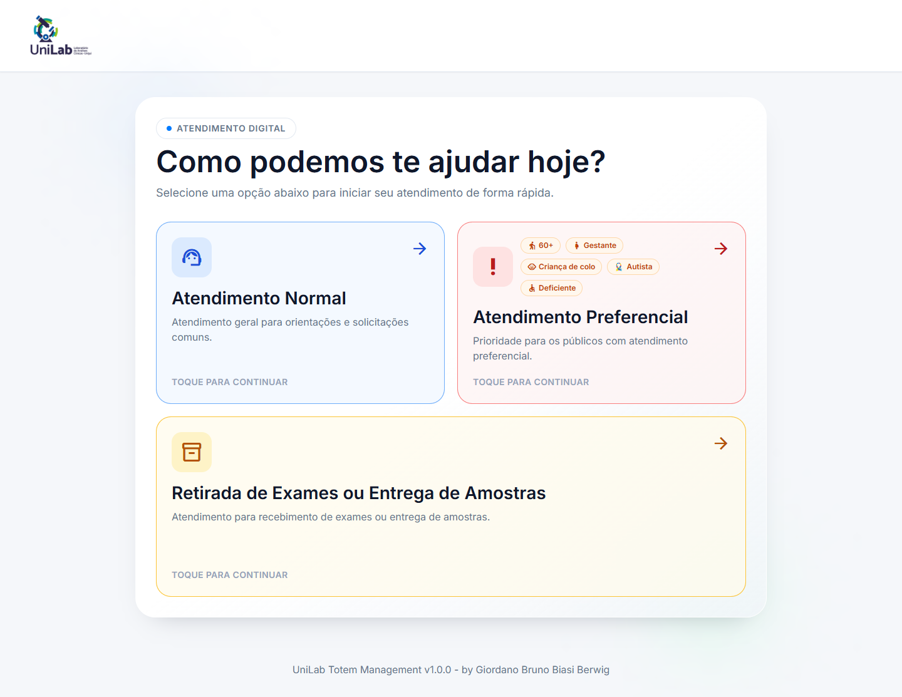
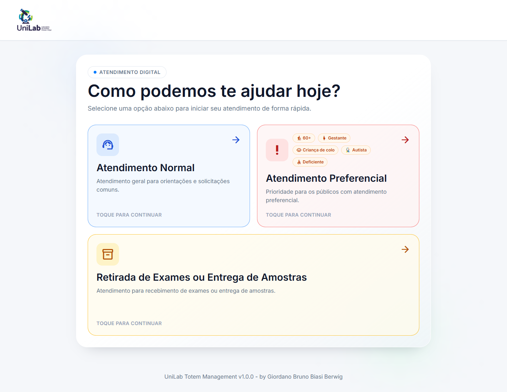
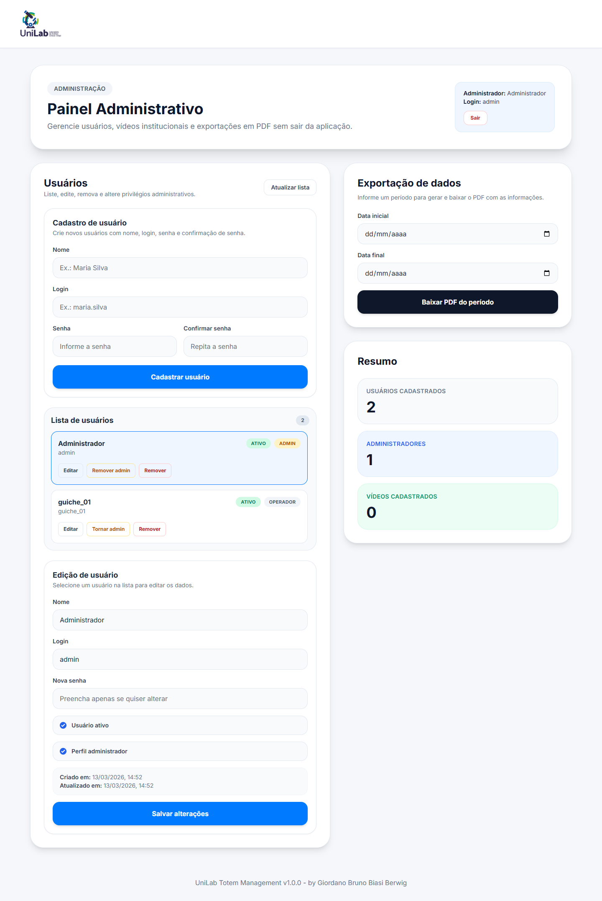
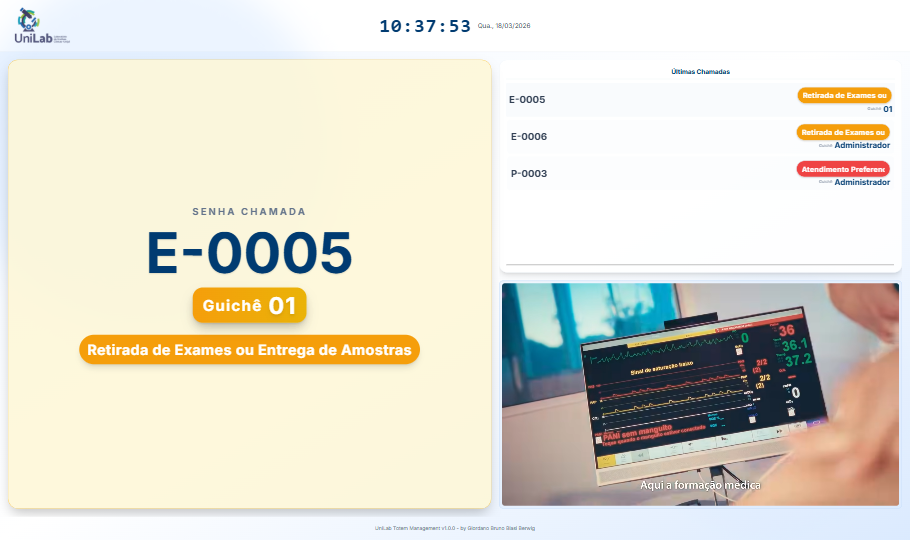
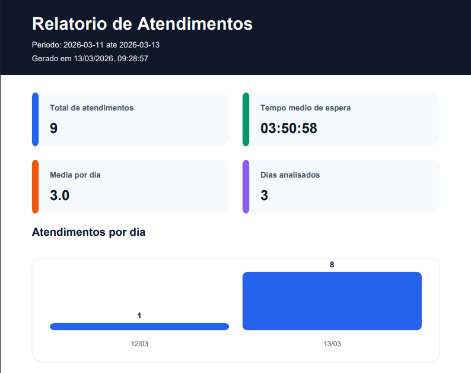
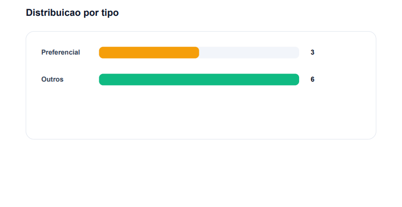
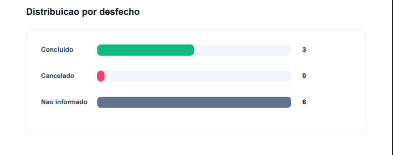

# UniLab Frontend Totem

Frontend application for UniLab ticketing and service operations.

This project covers the full totem workflow, from public ticket generation to internal attendant/admin operations and TV display mode. The app is built with React, TypeScript, and Vite, with modular screens, dedicated service layers, and API integration using `X-API-KEY` and Bearer authentication where required.

## Table of Contents

- Overview
- Screenshots
- Tech Stack
- Features
- Routes
- Project Structure
- Requirements
- Environment Setup
- Environment Variables
- Run Locally
- API Integration
- Authentication and Session
- Deployment (Nginx Example)
- Available Scripts
- Troubleshooting

## Overview

Implemented flows:

- Public screen for ticket generation by service type.
- Login screen for attendants and admins.
- Attendant panel with queue, current ticket, history, and call/recall/complete/cancel actions.
- Admin panel for users, videos, and attendance reports.
- TV panel to display current call, recent calls, and video playlist.

The frontend uses polling to keep operational screens synchronized with the backend and keeps a clear separation between UI components, screen logic, utilities, and service integrations.

## Screenshots

Screenshots were refreshed to reflect the latest UI updates.

### Public Ticket Screen



### Attendant Panel



### Admin Panel



### TV Screen



### Report Examples





## Tech Stack

- React 19
- TypeScript 5
- Vite 7
- React Router DOM 7
- ESLint 9
- jsPDF
- Tailwind CSS via CDN in `index.html`
- Google Material Icons Outlined

## Features

### Ticket Generation

- Select service type.
- Preferential service badges include 60+, Gestante, Criança de colo, Autista, and Deficiente.
- Send ticket creation request to the API.
- Show success/error feedback.

### Login and Session

- Username/password authentication.
- Session persistence in `sessionStorage`.
- Automatic redirect to protected routes.

### Attendant Panel

- Real-time waiting queue.
- Call next ticket from any type or specific type.
- Display current ticket in attendance.
- Recall current ticket.
- Complete current ticket.
- Cancel current ticket.
- Display recent completed history.

### Admin Panel

- List users.
- Update user data.
- Delete users.
- Promote/demote admin privileges.
- List/delete videos.
- Generate attendance reports by date range.

### TV Screen

- Display currently called ticket.
- Apply dynamic color theme (container + neon border) by service type.
- Display the 3 most recent calls.
- Use fixed-width recent-call badges with centered text and marquee loop for long service names.
- Play videos from local assets in `public/assets/video`.
- Force TV video playback without sound.
- Play alert sound from `public/assets/sound/sound.mp3` when a ticket is newly called or recalled.
- Keep TV layout fully visible in 100vh (header to footer) without page scroll.

## Routes

Current routes are defined in `src/App.tsx`:

- `/`: public ticket generation screen.
- `/tv`: TV display screen.
- `/login`: authentication screen.
- `/attendent`: protected attendant screen.
- `/admin`: protected admin screen.

## Project Structure

```text
.
|-- README-images/
|-- public/
|   |-- manifest.json
|   |-- assets/img/icons/
|-- src/
|   |-- auth/
|   |-- components/
|   |-- screens/
|   |-- services/
|   |-- App.tsx
|   |-- main.tsx
|-- .env.example
|-- index.html
|-- package.json
|-- README.md
```

## Requirements

- Node.js 20+
- npm 10+
- UniLab backend API running

## Environment Setup

1. Install dependencies:

```bash
npm install
```

2. Create `.env` from the example:

```bash
cp .env.example .env
```

PowerShell alternative:

```powershell
Copy-Item .env.example .env
```

3. Update environment values for your API.

## Environment Variables

Variables documented in `.env.example`:

```env
VITE_API_BASE_URL=http://localhost:8000/api
VITE_API_TICKETS_PATH=/tickets
VITE_USERS_PATH=/users
VITE_REPORT_PDF_PATH=/reports/attendances
VITE_TV_RECENTLY_CALLED_PATH=/tickets/recently-called
VITE_API_KEY=your-api-key-here
VITE_API_TIMEOUT_MS=10000
```

Description:

- `VITE_API_BASE_URL`: API base URL.
- `VITE_API_TICKETS_PATH`: base path for ticket resource.
- `VITE_USERS_PATH`: users resource path.
- `VITE_REPORT_PDF_PATH`: attendance report path.
- `VITE_TV_RECENTLY_CALLED_PATH`: TV recent calls path.
- `VITE_API_KEY`: key sent in `X-API-KEY` header.
- `VITE_API_TIMEOUT_MS`: request timeout in milliseconds.

## Run Locally

Development:

```bash
npm run dev
```

Default Vite URL:

- `http://localhost:5173`

Production build:

```bash
npm run build
```

Build preview:

```bash
npm run preview
```

Lint:

```bash
npm run lint
```

## API Integration

### Central Configuration

Main file: `src/services/apiConfig.ts`

Responsibilities:

- normalize base URL and resource paths,
- centralize `baseUrl`, `ticketsPath`, `apiKey`, and `timeoutMs`,
- build final API URLs for service modules.

### Ticket Creation

File: `src/services/ticketService.ts`

Operation:

- `POST {baseUrl}{ticketsPath}`

### Authentication

File: `src/services/authService.ts`

Operation:

- `POST {baseUrl}/login`

Headers:

- `Content-Type: application/json`
- `X-API-KEY: <VITE_API_KEY>`

### Attendant Operations

File: `src/services/attendantService.ts`

Operations:

- `GET {baseUrl}{ticketsPath}`
- `GET {baseUrl}{ticketsPath}/completed`
- `POST {baseUrl}{ticketsPath}/{id}/call`
- `POST {baseUrl}{ticketsPath}/{id}/recall`
- `PATCH {baseUrl}{ticketsPath}/{id}/complete`
- `PATCH {baseUrl}{ticketsPath}/{id}/cancel`

Protected attendant routes send both headers:

- `X-API-KEY`
- `Authorization: Bearer <access_token>`

### Admin Operations

File: `src/services/adminService.ts`

Includes user management, video listing/removal, and report generation.

### TV Operations

File: `src/services/tvService.ts`

Operations:

- `GET /tickets/recently-called`

Video source behavior:

- TV videos are discovered from local public assets using Vite glob import (`/public/assets/video/**/*.mp4`).
- Playback uses direct static URLs (`/assets/video/...`) with loop enabled.

Important:

- TV keeps polling recent calls from API and updates visual/sound alerts in real time.

## Authentication and Session

Main files:

- `src/auth/session.ts`
- `src/components/auth/ProtectedRoute.tsx`

Current behavior:

- session is stored in `sessionStorage` under `totem_auth`,
- protected routes require `access_token`,
- when `requireAdmin` is set, non-admin users are redirected to `/attendent`.

Expected session fields:

- `data.access_token`
- `data.user.login`
- `data.user.is_admin`

## Deployment (Nginx Example)

Example virtual host for deploying the built frontend with React Router fallback and HTTPS. Replace placeholders with your own values.

```nginx
server {
  server_name your-domain.example;

  root /var/www/your-app;
  index index.html;

  # Serve static files; fallback to index.html for client-side routes.
  location / {
    try_files $uri $uri/ /index.html;
  }

  # Cache static assets.
  location ~* \.(?:css|js|jpg|jpeg|gif|png|svg|ico|ttf|woff|woff2|eot)$ {
    try_files $uri =404;
    expires 7d;
    add_header Cache-Control "public, max-age=604800, immutable";
    access_log off;
  }

  # Avoid caching HTML-like responses.
  location ~* \.(?:html|htm|json|xml|txt)$ {
    add_header Cache-Control "no-cache, must-revalidate";
  }

  # Basic security headers.
  add_header X-Content-Type-Options nosniff;
  add_header X-Frame-Options SAMEORIGIN;
  add_header X-XSS-Protection "1; mode=block";

  # Gzip
  gzip on;
  gzip_types text/plain text/css application/json application/javascript text/xml application/xml text/javascript;
  gzip_min_length 256;

  listen [::]:443 ssl;
  listen 443 ssl;
  ssl_certificate /etc/letsencrypt/live/your-domain.example/fullchain.pem;
  ssl_certificate_key /etc/letsencrypt/live/your-domain.example/privkey.pem;
  include /etc/letsencrypt/options-ssl-nginx.conf;
  ssl_dhparam /etc/letsencrypt/ssl-dhparams.pem;
}

server {
  if ($host = your-domain.example) {
    return 301 https://$host$request_uri;
  }

  listen 80;
  listen [::]:80;
  server_name your-domain.example;
  return 404;
}
```

## Available Scripts

- `npm run dev`: start development mode.
- `npm run build`: type-check and build for production.
- `npm run preview`: preview the production build locally.
- `npm run lint`: run lint rules.

## Troubleshooting

### API is not responding

- confirm backend is running,
- verify `VITE_API_BASE_URL`,
- verify `VITE_API_KEY`,
- test endpoints directly with the same headers used by the app.

### TV does not play local videos

- confirm files exist under `public/assets/video`,
- verify file extension is supported (`.mp4`),
- run `npm run build` and check if video assets are present in `dist/assets`.

### TV alert sound does not play

- confirm `public/assets/sound/sound.mp3` exists,
- verify the TV browser/session allows media autoplay,
- validate there is at least one ticket change (new call or recall) after the initial load.

### Protected routes redirect to login

- inspect `sessionStorage` data,
- validate token expiration,
- confirm `is_admin` before accessing `/admin`.

### Build fails

- run `npm run build` to inspect full output,
- review import paths,
- check type safety in new services/components.
